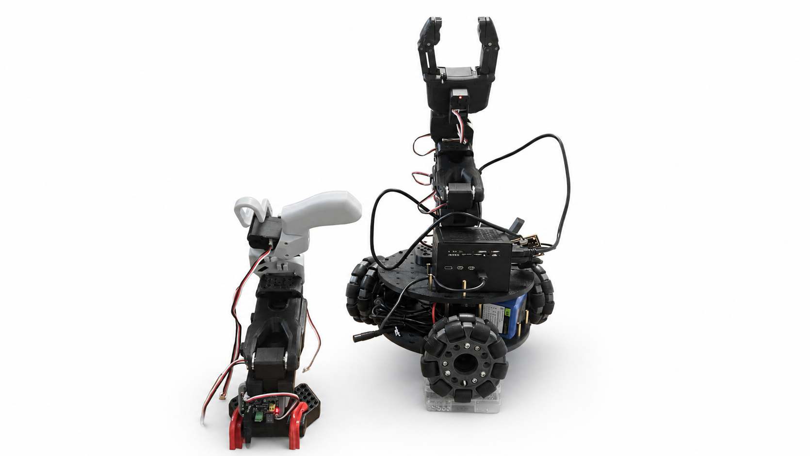
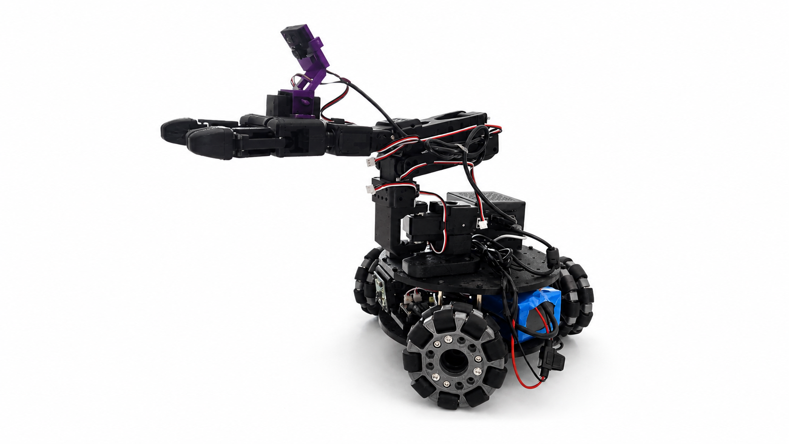
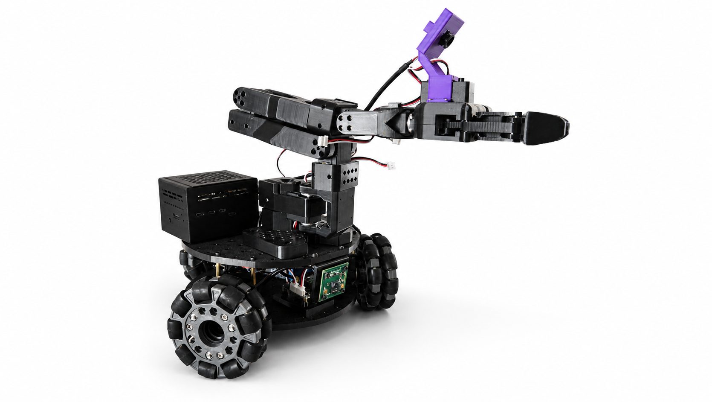
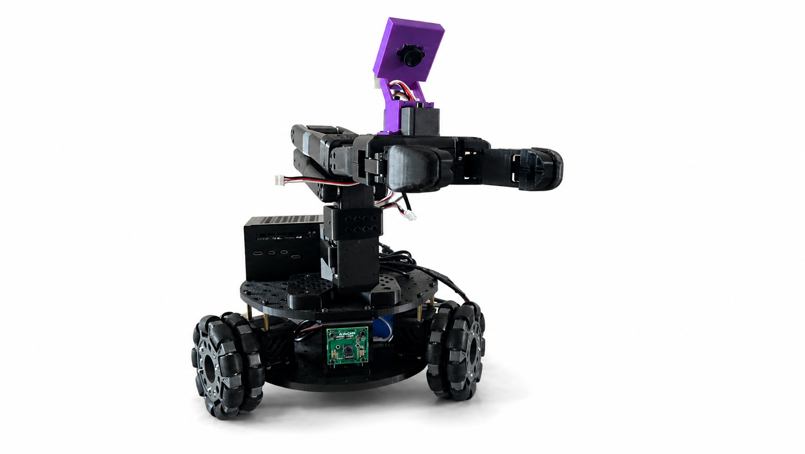
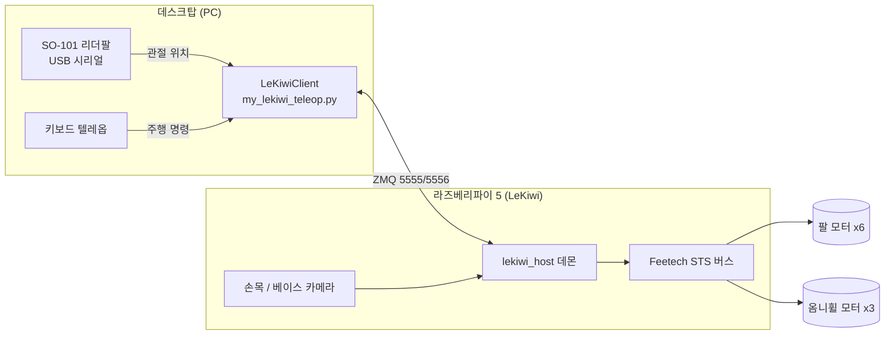

# LeKiwi Mobile Manipulator

오픈소스 LeRobot의 LeKiwi(옴니휠 베이스 + SO-101 팔) 설계를 직접 조립하고, 리더팔로 원격 조종되는 상태까지 세팅한 기록입니다.

완성된 로봇을 받아서 쓰는 것이 아니라, 모터 하나하나의 ID를 굽고, 관절 가동범위를 캘리브레이션하고, 리더팔–팔로워 통신을 맞추는 구동 과정 자체를 직접 구축했습니다. lerobot 0.6.2 기준.



| 항목 | 사양 |
| --- | --- |
| 로봇팔 | SO-101 팔로워, Feetech STS3215 × 6 |
| 그리퍼 | Pin Gripper |
| 베이스 | 3륜 옴니휠, STS3215 × 3 |
| 메인 컴퓨터 | Raspberry Pi 5 / Ubuntu 24.04 |
| 조종 | SO-101 리더팔(데스크탑 USB) + 키보드 |
| 카메라 | 손목캠 Pecxin-1M-2012V1 / 베이스캠 Arducam |
| 모터 배터리 | 리튬이온 3S 12.6V (3S2P 21700) |
| 모터 드라이버 | Waveshare Serial Bus Servo Driver (DC 9~12.6V, USB/UART) |
| 시뮬레이션 | Gazebo (옴니휠+라이다 주행/Nav2 검증용) |
| 개발 기간 | 2026– |

## 현재까지 된 것

모터 세팅
- 팔로워 9축(팔 6 + 옴니휠 3) ID 등록 및 스캔 검증
- 리더팔 6축 ID 등록
- 공장값(전부 ID 1) 충돌을 피해 한 축씩 등록하는 절차 확립

캘리브레이션
- 팔로워/리더 전 관절 호밍 + 가동범위 측정, 정규화값으로 검증
- 손으로 안 움직이는 그리퍼는 모터로 구동해 스톨 지점으로 범위 측정
- 엔코더 경계를 걸치는 관절은 궤적 unwrap 후 중앙 재정렬

조종 (teleop)
- 데스크탑 ↔ Pi ZMQ 연결, 옴니휠 6방향 주행 확인
- 리더팔 → 팔로워 팔 미러링(부드러운 램프 시작)
- 전체 조종(팔 + 주행)은 배터리 충전 후 마무리 예정

## 하드웨어

옴니휠 3륜 베이스 위에 SO-101 팔로워 팔을 올린 구성. 베이스에 라즈베리파이 5와 모터 드라이버, 3S 리튬이온 배터리를 실었고, 손목과 베이스에 카메라를 두었다. 조종은 같은 STS3215로 만든 SO-101 리더팔을 데스크탑에 USB로 연결해서 한다.

| | |
| --- | --- |
|  |  |
|  |  |

## 구조



작업에서 지킨 것:

1. 한 번에 한 축씩 검증 — 모터 ID를 하나 새길 때마다 스캔으로 확인하고, 캘리 저장 후엔 정규화 위치값이 범위 안에 드는지로 검증. 눈에 보이는 근거를 확보한 뒤 다음 단계로.
2. 팔로워는 Pi, 조종 로직은 데스크탑 — Pi는 모터·카메라를 다루는 호스트 데몬만, 리더팔·키보드 입력과 매핑은 데스크탑 클라이언트가 담당. 역할을 나눠 디버깅을 단순하게.
3. 증거 기반 디버깅 — "안 된다" 대신 통신 응답코드(무응답 -6 / 충돌 -7), 실측 전압, 발견된 모터 목록 같은 관측값으로 원인을 좁혔다.

## 파일 구성

```
lerobot-lekiwi-mobile-manipulator/
├── pi_tools/                 # 라즈베리파이(팔로워)에서 실행
│   ├── scan_motors.py        # 모터 ID 스캔
│   ├── setup_one.py          # 모터 ID 한 축씩 등록
│   ├── calib_step1.py        # 캘리 1단계 - 가운데자세 호밍
│   ├── record_arm.py         # 캘리 2단계 - 팔 관절 범위 기록(이상값 필터)
│   ├── gripper_range.py      # 그리퍼 범위 - 모터로 구동해 측정
│   ├── wrist_sweep.py        # 손목굽힘 궤적 기록
│   ├── wrist_fix.py          # 손목굽힘 unwrap 재중심
│   ├── calib_finalize.py     # 캘리 병합/저장/검증
│   ├── read_batt.py          # 모터 배터리 전압 읽기
│   └── run_host.sh           # 호스트 데몬 실행
├── desktop/                  # 데스크탑에서 실행 (리더팔 연결)
│   ├── my_lekiwi_teleop.py   # 전체 조종 (리더팔 + 키보드)
│   ├── leader_setup_one.py   # 리더팔 모터 ID 등록
│   ├── leader_sweep_all.py   # 리더팔 전관절 스윕
│   ├── leader_finalize.py    # 리더팔 캘리
│   ├── wheel_test.py         # 바퀴 6방향 테스트
│   ├── wheel_test_slow.py    # 바퀴 천천히(관찰용)
│   └── arm_teleop_test.py    # 팔 미러링만 (헤드리스)
└── docs/
    ├── images/               # 로봇 사진
    └── 개발노트.md            # 진행 내역 + 전체 디버깅 기록
```

## 실행

### 1. 모터 ID 등록

새 STS3215는 전부 공장값 ID 1이라 버스에 여럿 물리면 충돌한다. 한 번에 하나만 연결해 등록.

```bash
# 팔로워 (Pi)  gripper6 → wrist_roll5 → wrist_flex4 → elbow3 → shoulder_lift2 → shoulder_pan1 → wheels 9,8,7
python pi_tools/setup_one.py arm_gripper
# 리더 (데스크탑)  gripper6 → 5 → 4 → 3 → 2 → 1
python desktop/leader_setup_one.py gripper
# 확인
python pi_tools/scan_motors.py
```

등록 전에 항상 스캔해 버스에 ID 1이 하나만 있는지 확인할 것. 아니면 이미 등록된 모터를 덮어쓴다.

### 2. 캘리브레이션

```bash
# 팔로워 (Pi)
python pi_tools/calib_step1.py       # 팔을 각 관절 가운데로 두고 실행
python pi_tools/record_arm.py        # 팔 4관절 끝~끝 왕복, 끝나면 touch /tmp/record_arm_stop
python pi_tools/gripper_range.py     # 그리퍼는 기어라 모터로 구동해 측정
python pi_tools/calib_finalize.py    # 병합/저장/검증

# 리더 (데스크탑)
python desktop/leader_sweep_all.py   # 6관절 끝~끝 스윕, 끝나면 touch /tmp/leader_stop
python desktop/leader_finalize.py    # unwrap 자동중심 + 마진으로 저장
```

### 3. 조종

```bash
# Pi에서 호스트 데몬 (SSH 끊겨도 유지: setsid nohup)
ssh <pi> 'cd ~/lerobot && source .venv/bin/activate && \
  setsid nohup python -m lerobot.robots.lekiwi.lekiwi_host --robot.id=my_lekiwi --host.connection_time_s=3600 >/tmp/host.log 2>&1 </dev/null &'

# 데스크탑에서 조종 (리더팔로 팔, W/S/A/D/Z/X로 주행)
cd ~/lerobot && source .venv/bin/activate
LEKIWI_IP=<pi-ip> python my_lekiwi_teleop.py
```

부분 확인: 팔만 `arm_teleop_test.py`, 바퀴만(공중에 띄우고) `wheel_test_slow.py`.

## 트러블슈팅

세팅하며 실제로 부딪혀 해결한 것들 중 핵심만. 전체 기록은 [`docs/개발노트.md`](docs/개발노트.md).

- **캘리 범위가 엔코더 경계(0/4095)를 걸침** — 호밍 기준(가운데자세)이 실제 중앙과 어긋나면 관절 범위가 0↔4095 이음매를 넘어가 정규화값이 100%를 초과한다. 궤적을 raw로 기록해 unwrap한 뒤, 범위 중앙이 2047이 되도록 호밍을 다시 계산해 해결(`wrist_sweep.py` → `wrist_fix.py`).
- **모터가 통신은 되는데 안 움직임** — `write_calibration`이 캘리 범위를 모터의 위치제한(Min/Max_Position_Limit)으로도 굽는데, 잘못된(폭 1) 범위가 새겨져 그리퍼가 1스텝 안에 갇혀 있었다. 제한을 0~4095로 풀고 재측정.
- **손으로 안 움직이는 그리퍼 캘리** — 기어비 때문에 역구동이 안 되는 그리퍼는 손 기록이 불가능. 모터에 토크를 주고 소폭씩 밀며 위치 변화가 멈추는(스톨) 지점을 양방향으로 찾아 물리 범위를 측정(`gripper_range.py`).
- **리더팔 통신 두절을 응답코드로 격리** — 전원·점퍼(A=UART/B=USB)·케이블을 다 확인해도 무응답. 핑 응답이 무응답(-6)인지 충돌(-7)인지, `bus.connect()`의 발견 모터 목록에서 특정 ID가 빠지는지로 좁혀, 최종적으로 드라이버 보드 불량으로 판정하고 교체해 해결.
- **조종 중 모터 간헐 드롭** — 특정 축(때마다 다름)이 버스에서 빠지며 호스트가 죽음. 응답하는 모터에서 버스 전압을 읽어 10.5V(3S 방전 근처)임을 확인, 부하 시 전압 sag로 인한 브라운아웃으로 판단(`read_batt.py`).
- **바퀴 명령만 보내면 안 움직임** — 호스트의 `send_action`이 x/y/theta.vel 세 키를 항상 요구(옴니휠 역기구학). 팔(.pos)과 바퀴(.vel)를 함께 보내야 정상 동작.

## 앞으로 할 것

- [x] 팔로워/리더 모터 ID 등록
- [x] 팔로워/리더 캘리브레이션
- [x] 데스크탑↔Pi 연결, 옴니휠 주행 확인
- [x] 리더팔 → 팔로워 팔 미러링 확인
- [ ] 배터리 충전 후 전체 조종(팔 + 주행) 마무리
- [ ] 손목/베이스 카메라 스트리밍 확인
- [ ] Gazebo에 옴니휠+라이다 URDF 올려 SLAM/Nav2 주행 시뮬 검증 (실물 이관 전)
- [ ] 조종 시연 데이터 수집 (`lerobot record`)
- [ ] 수집 데이터로 정책 학습 및 자율 파지 실험
