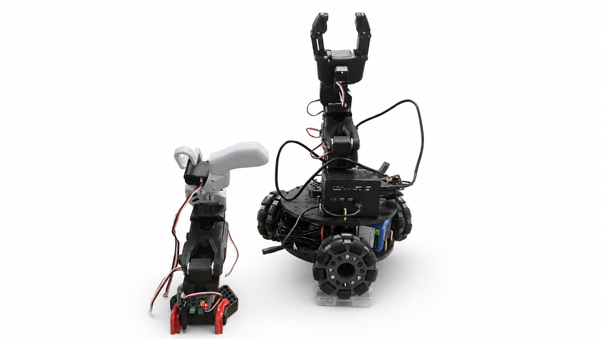
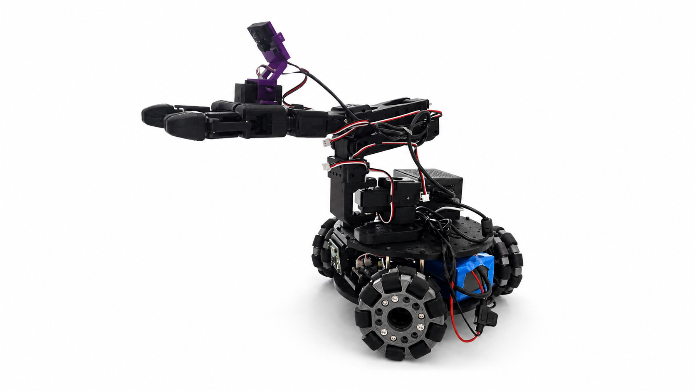
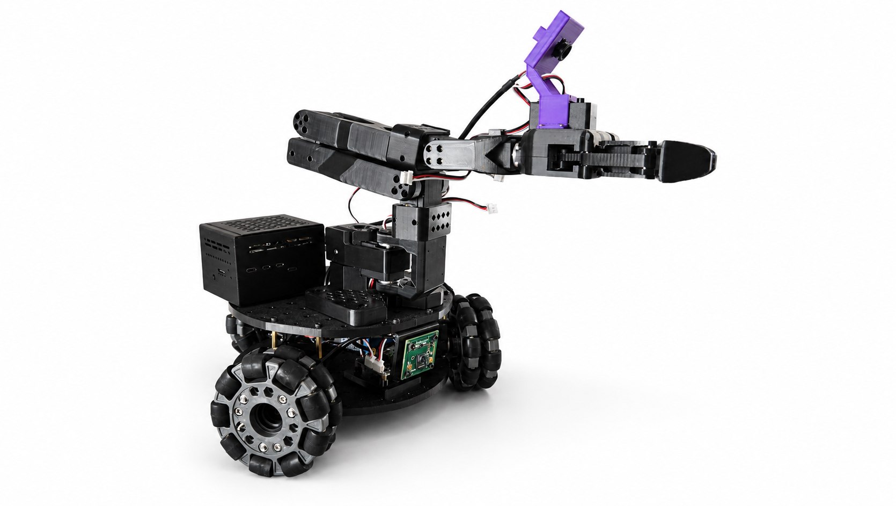
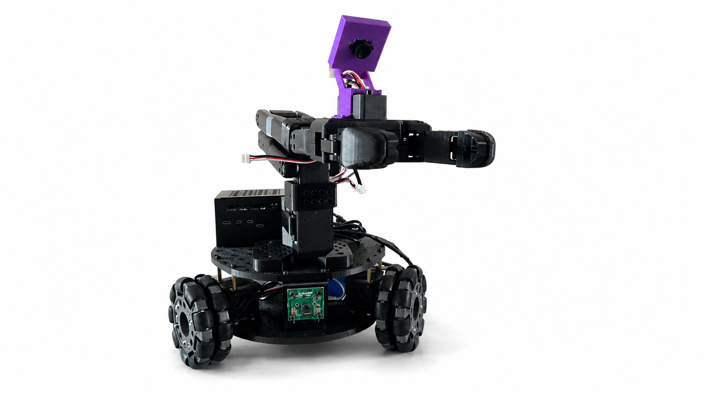
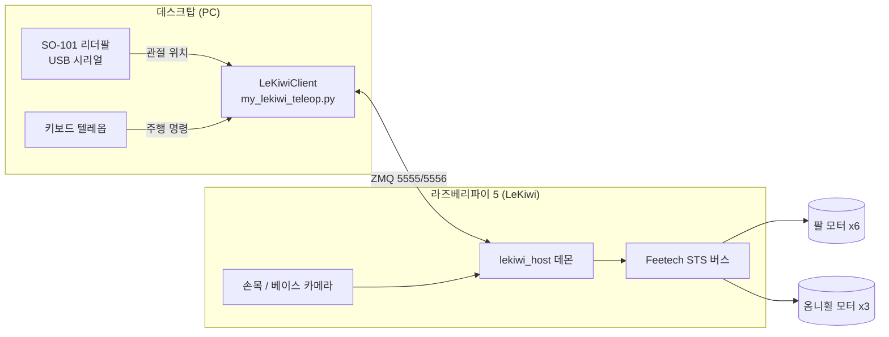
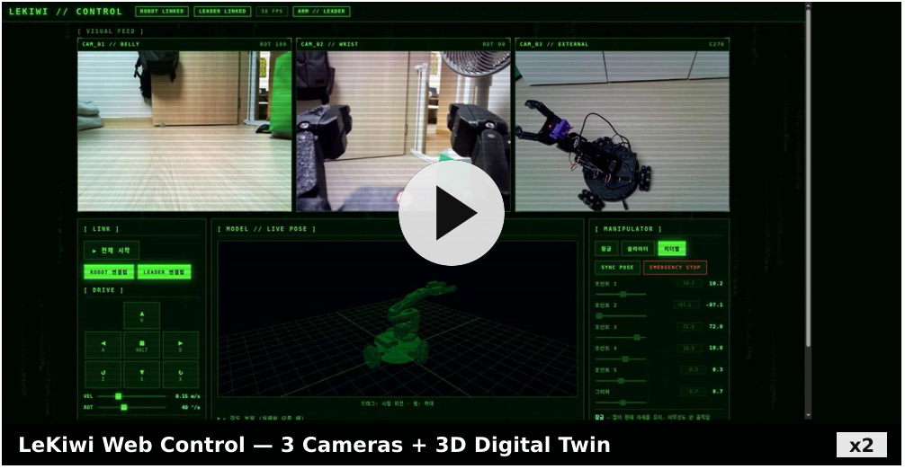

# LeKiwi Mobile Manipulator

오픈소스 LeRobot의 LeKiwi(옴니휠 베이스 + SO-101 팔) 설계를 직접 조립하고, 리더팔 원격 조종을 거쳐 색깔 블록을 스스로 찾아 보관함에 넣는 자율 집기까지 구현한 기록입니다.

완성된 로봇을 받아서 쓰는 것이 아니라, 모터 하나하나의 ID를 굽고, 관절 가동범위를 캘리브레이션하고, 리더팔–팔로워 통신을 맞추는 구동 과정 자체를 직접 구축했습니다. lerobot 0.6.2 기준.



| 항목  | 사양  |
| --- | --- |
| 로봇팔 | SO-101 팔로워, Feetech STS3215 × 6 |
| 그리퍼 | Pin Gripper |
| 베이스 | 3륜 옴니휠, STS3215 × 3 |
| 메인 컴퓨터 | Raspberry Pi 5 / Ubuntu 24.04 |
| 조종 | SO-101 리더팔(데스크탑 USB) + 키보드 |
| 카메라 | 손목캠 Pecxin-1M-2012V1 / 베이스캠 Arducam / 외부 Logitech C270(촬영용) |
| 모터 배터리 | 리튬이온 3S 12.6V (3S2P 21700) |
| 모터 드라이버 | Waveshare Serial Bus Servo Driver (DC 9~12.6V, USB/UART) |
| 관제 화면 | 브라우저 웹 GUI (카메라 3대 + 3D 디지털 트윈 + 조종) |
| 자율 집기 | OpenCV 색 검출 + ArUco 마커, 규칙 기반 제어 (학습 모델 없음) |
| 시뮬레이션 | Gazebo (옴니휠+라이다 주행/Nav2 검증용) |
| 개발 기간 | 2026– |

## 현재까지 된 것

모터 세팅
- 팔로워 9축(팔 6 + 옴니휠 3) ID 등록 및 스캔 검증
- 리더팔 6축 ID 등록
- 공장값(전부 ID 1) 충돌을 피해 한 축씩 등록하는 절차 확립

캘리브레이션
- 팔로워/리더 전 관절 호밍 + 가동범위 측정, 정규화값으로 검증
- 손으로 안 움직이는 그리퍼는 모터로 구동해 스톨 지점으로 범위 측정
- 엔코더 경계를 걸치는 관절은 궤적 unwrap 후 중앙 재정렬

조종 (teleop)
- 데스크탑 ↔ Pi ZMQ 연결, 옴니휠 6방향 주행 확인
- 리더팔 → 팔로워 팔 미러링(부드러운 램프 시작)
- 전체 조종(팔 + 주행) 동작 확인

웹 관제 화면
- 카메라 3대(베이스 · 손목 · 외부) 동시 스트리밍
- 실제 STL 로 만든 3D 디지털 트윈 - 로봇 자세를 20Hz 로 따라감
- 브라우저에서 주행 · 팔 조종, 관절 각도 직접 입력
- 연결이 끊기면 화면에 표시하고 자동 재연결

자율 집기
- 빨강 · 노랑 블록을 베이스캠으로 찾아(좌우 훑기 → 한 바퀴) 다가감
- 손목캠으로 넘겨받아 옴니휠로 기준점 정렬 → 리더팔로 가르친 자세로 집기
- 그리퍼가 멈춘 값으로 집기 성공 판정, 실패 시 재정렬
- ArUco 마커로 보관함 거리를 재고 0.28m 앞에 서서 넣기 - 3회 연속 성공

## 자율 집기

<a href="https://youtu.be/ivkX3ZNEQ3s"></a>

바닥의 블록을 찾아 집고 보관함에 넣는 전 과정(3배속 미리보기). 이미지를 누르면 전체 영상(YouTube)으로 이동한다.

팔 각도를 매번 역기구학으로 푸는 대신, **옴니휠로 몸 전체를 움직여 블록이 손목캠의 같은 자리에 오게** 만들고, 팔은 리더팔로 가르친 자세(보기 · 집기 · 넣기)만 반복한다. 옴니휠은 앞뒤 · 좌우 · 회전이 독립이라 화면 오차를 그대로 바퀴 명령으로 바꿀 수 있다.

| 단계  | 카메라  | 방법  |
| --- | --- | --- |
| 찾기 · 다가가기 | 베이스캠 | HSV 색 검출, 화면 중심 오차로 회전하며 전진 |
| 정렬 | 손목캠 | 3cm 이동 시 화면 이동량을 스스로 측정 → 오차를 바퀴 이동으로 환산 |
| 집기 확인 | 손목캠 + 그리퍼 | 블록을 물면 46에서 멈춤, 빈손이면 94.5까지 닫힘 |
| 보관함 | 베이스캠 | ArUco 마커 크기로 거리 계산(초점거리 650px, 두 방법으로 교차 확인) |

```bash
cd desktop/web && ./start_lekiwi.sh       # 웹 서버 (로봇 연결을 쥠)
cd desktop/pick && python auto_pick.py red yellow
```

설계 · 색 기준값 · 실측 데이터는 [`docs/자율집기.md`](docs/자율집기.md).

## 하드웨어

옴니휠 3륜 베이스 위에 SO-101 팔로워 팔을 올린 구성. 베이스에 라즈베리파이 5와 모터 드라이버, 3S 리튬이온 배터리를 실었고, 손목과 베이스에 카메라를 두었다. 조종은 같은 STS3215로 만든 SO-101 리더팔을 데스크탑에 USB로 연결해서 한다.

|  |  |
| --- | --- |
|  |  |
|  |  |

## 구조


```mermaid
flowchart LR
    subgraph Desktop["데스크탑 (PC)"]
        Leader[SO-101 리더팔<br/>USB 시리얼]
        KB[키보드 텔레옵]
        Client[LeKiwiClient<br/>my_lekiwi_teleop.py]
    end
    subgraph Pi["라즈베리파이 5 (LeKiwi)"]
        Host[lekiwi_host 데몬]
        Bus[Feetech STS 버스]
        Cams[손목 / 베이스 카메라]
    end
    ArmM[(팔 모터 x6)]
    WheelM[(옴니휠 모터 x3)]

    Leader -->|관절 위치| Client
    KB -->|주행 명령| Client
    Client <-->|ZMQ 5555/5556| Host
    Host --> Bus
    Bus --> ArmM
    Bus --> WheelM
    Cams --> Host
```

작업에서 지킨 것:

1. 한 번에 한 축씩 검증 - 모터 ID를 하나 새길 때마다 스캔으로 확인하고, 캘리 저장 후엔 정규화 위치값이 범위 안에 드는지로 검증. 눈에 보이는 근거를 확보한 뒤 다음 단계로.
2. 팔로워는 Pi, 조종 로직은 데스크탑 - Pi는 모터 · 카메라를 다루는 호스트 데몬만, 리더팔 · 키보드 입력과 매핑은 데스크탑 클라이언트가 담당. 역할을 나눠 디버깅을 단순하게.
3. 증거 기반 디버깅 - "안 된다" 대신 통신 응답코드(무응답 -6 / 충돌 -7), 실측 전압, 발견된 모터 목록 같은 관측값으로 원인을 좁혔다.

## 파일 구성

```
lerobot-lekiwi-mobile-manipulator/
├── pi_tools/                 # 라즈베리파이(팔로워)에서 실행
│   ├── scan_motors.py        # 모터 ID 스캔
│   ├── setup_one.py          # 모터 ID 한 축씩 등록
│   ├── calib_step1.py        # 캘리 1단계 - 가운데자세 호밍
│   ├── record_arm.py         # 캘리 2단계 - 팔 관절 범위 기록(이상값 필터)
│   ├── gripper_range.py      # 그리퍼 범위 - 모터로 구동해 측정
│   ├── wrist_sweep.py        # 손목굽힘 궤적 기록
│   ├── wrist_fix.py          # 손목굽힘 unwrap 재중심
│   ├── calib_finalize.py     # 캘리 병합/저장/검증
│   ├── read_batt.py          # 모터 배터리 전압 읽기
│   ├── read_ups.py           # 라즈베리파이 UPS 배터리 읽기 (I2C)
│   ├── run_host.sh           # 호스트 데몬 실행 (-b 백그라운드+자동 재시작 / -s 상태 / -k 중지)
│   └── host_watchdog.sh      # 호스트가 죽으면 다시 켜는 감시 루프
├── desktop/                  # 데스크탑에서 실행 (리더팔 연결)
│   ├── my_lekiwi_teleop.py   # 전체 조종 (리더팔 + 키보드)
│   ├── leader_setup_one.py   # 리더팔 모터 ID 등록
│   ├── leader_sweep_all.py   # 리더팔 전관절 스윕
│   ├── leader_finalize.py    # 리더팔 캘리
│   ├── wheel_test.py         # 바퀴 6방향 테스트
│   ├── wheel_test_slow.py    # 바퀴 천천히(관찰용)
│   ├── arm_teleop_test.py    # 팔 미러링만 (헤드리스)
│   ├── pick/                 # 자율 집기
│   │   ├── auto_pick.py      # 전체 흐름 (찾기→다가가기→정렬→집기→보관함→넣기)
│   │   ├── color_detect.py   # HSV 색 블록 검출 (색 · 카메라별 기준)
│   │   ├── approach_marker.py# ArUco 마커 거리 · 보관함 접근
│   │   ├── robot_api.py      # 웹 서버 API 래퍼 (최신 프레임만 유지)
│   │   ├── poses.json        # 가르친 자세 · 기준점 · 그리퍼 기준값
│   │   ├── record.py         # 시연 녹화 (외부+베이스+손목 합본)
│   │   ├── make_aruco.py     # 마커 인쇄 PDF 생성
│   │   ├── aruco_box_3.5cm.pdf
│   │   └── test_drive_dir.py # 주행 방향 실측
│   └── web/                  # 웹 관제 화면
│       ├── lekiwi_web.py     # 서버 (카메라 중계 + 조종 API + 워치독)
│       ├── lekiwi_web.html   # 화면 (3D 트윈 포함)
│       ├── fetch_meshes.py   # 3D 메시 받아서 브라우저용으로 변환
│       ├── start_lekiwi.sh   # 웹서버 + 브라우저 한 번에
│       └── watch_leader.py   # 리더팔 값 실시간 확인 (진단용)
└── docs/
    ├── images/               # 로봇 사진, 웹 GUI 화면
    ├── demo/, media/         # 데모 GIF · 영상
    ├── 웹GUI.md               # 웹 관제 화면 상세 (좌표계 · 각도 변환 함정 정리)
    ├── 자율집기.md            # 자율 집기 설계 · 실측값 · 결과
    └── 개발노트.md            # 진행 내역 + 전체 디버깅 기록
```

## 실행

### 1. 모터 ID 등록

새 STS3215는 전부 공장값 ID 1이라 버스에 여럿 물리면 충돌한다. 한 번에 하나만 연결해 등록.

```bash
# 팔로워 (Pi)  gripper6 → wrist_roll5 → wrist_flex4 → elbow3 → shoulder_lift2 → shoulder_pan1 → wheels 9,8,7
python pi_tools/setup_one.py arm_gripper
# 리더 (데스크탑)  gripper6 → 5 → 4 → 3 → 2 → 1
python desktop/leader_setup_one.py gripper
# 확인
python pi_tools/scan_motors.py
```

등록 전에 항상 스캔해 버스에 ID 1이 하나만 있는지 확인할 것. 아니면 이미 등록된 모터를 덮어쓴다.

### 2. 캘리브레이션

```bash
# 팔로워 (Pi)
python pi_tools/calib_step1.py       # 팔을 각 관절 가운데로 두고 실행
python pi_tools/record_arm.py        # 팔 4관절 끝~끝 왕복, 끝나면 touch /tmp/record_arm_stop
python pi_tools/gripper_range.py     # 그리퍼는 기어라 모터로 구동해 측정
python pi_tools/calib_finalize.py    # 병합/저장/검증

# 리더 (데스크탑)
python desktop/leader_sweep_all.py   # 6관절 끝~끝 스윕, 끝나면 touch /tmp/leader_stop
python desktop/leader_finalize.py    # unwrap 자동중심 + 마진으로 저장
```

### 3. 조종

```bash
# Pi에서 호스트 데몬 (SSH 끊겨도 유지: setsid nohup)
ssh <pi> 'cd ~/lerobot && source .venv/bin/activate && \
  setsid nohup python -m lerobot.robots.lekiwi.lekiwi_host --robot.id=my_lekiwi --host.connection_time_s=3600 >/tmp/host.log 2>&1 </dev/null &'

# 데스크탑에서 조종 (리더팔로 팔, W/S/A/D/Z/X로 주행)
cd ~/lerobot && source .venv/bin/activate
LEKIWI_IP=<pi-ip> python my_lekiwi_teleop.py
```

부분 확인: 팔만 `arm_teleop_test.py`, 바퀴만(공중에 띄우고) `wheel_test_slow.py`.

## 웹 관제 화면

브라우저 하나에서 카메라 3대를 보면서 로봇을 조종한다. 팔 자세는 실제 STL 로 만든
3D 모델이 실시간으로 따라간다.

<a href="https://youtu.be/RbKLVp3t7v8"></a>

리더팔로 조종하는 모습. 카메라 3대와 3D 트윈이 함께 따라간다.

```bash
# 준비 (처음 한 번만) - 3D 메시를 공개 저장소에서 받아 브라우저용으로 변환
cd desktop/web && python3 fetch_meshes.py

# 실행
./start_lekiwi.sh          # 웹서버 + 브라우저
# 화면의 「전체 시작」 버튼 → Pi 데몬 확인 → 로봇 연결 → 리더팔 연결까지 자동
```

| 구역  | 내용  |
| --- | --- |
| 카메라 | 베이스(Arducam, 180° 보정) / 손목(90° 보정) / 외부 웹캠 |
| 3D 트윈 | 관절 6축 + 옴니휠 3개가 실제 값을 따라 움직임 |
| 주행 | 버튼 또는 W/S · A/D · Z/X, 속도 조절 |
| 팔 | 잠금 / 슬라이더(각도 직접 입력) / 리더팔 미러링 |

### 3D 모델은 URDF 세 개를 합쳐서 만든다

| 부분  | 출처  | 이유  |
| --- | --- | --- |
| 베이스 · 옴니휠 | [SIGRobotics-UIUC/LeKiwi](https://github.com/SIGRobotics-UIUC/LeKiwi) | 베이스 형상 |
| 팔 6축 | [TheRobotStudio/SO-ARM100](https://github.com/TheRobotStudio/SO-ARM100) | **각도 정의가 lerobot 과 일치** |
| Pin 그리퍼 | [smart-factory-soarm101](https://github.com/kimar1022-code/smart-factory-soarm101) | 실제 장착한 그리퍼 |

팔을 LeKiwi URDF 로 그리면 관절이 실물과 반대로 돈다. 두 URDF 가 다른 도구로
만들어져 축 규약이 다르기 때문. SO-101 URDF 는 가동범위가 lerobot 캘리브레이션
값과 거의 일치해(어깨들기 ±97.9° vs ±100°) 부호 보정 없이 그대로 쓸 수 있다.

베이스와 팔을 잇는 변환은 **같은 부품(팔 베이스)을 두 URDF 가 각각 어떻게 놓았는지**
비교해서 계산한다. `so_base_link = LeKiwi_link · lk_visual · so_visual⁻¹` 로 풀면
`xyz=[0, 0.0283, 0.007], rpy=[0,0,90°]` 가 나온다. 딱 떨어지는 값이라 시행착오가
아님을 알 수 있다.


## 트러블슈팅

세팅하며 실제로 부딪혀 해결한 것들 중 핵심만. 전체 기록은 [`docs/개발노트.md`](docs/개발노트.md).

- **캘리 범위가 엔코더 경계(0/4095)를 걸침** - 호밍 기준(가운데자세)이 실제 중앙과 어긋나면 관절 범위가 0↔4095 이음매를 넘어가 정규화값이 100%를 초과한다. 궤적을 raw로 기록해 unwrap한 뒤, 범위 중앙이 2047이 되도록 호밍을 다시 계산해 해결(`wrist_sweep.py` → `wrist_fix.py`).
- **모터가 통신은 되는데 안 움직임** - `write_calibration`이 캘리 범위를 모터의 위치제한(Min/Max_Position_Limit)으로도 굽는데, 잘못된(폭 1) 범위가 새겨져 그리퍼가 1스텝 안에 갇혀 있었다. 제한을 0~4095로 풀고 재측정.
- **손으로 안 움직이는 그리퍼 캘리** - 기어비 때문에 역구동이 안 되는 그리퍼는 손 기록이 불가능. 모터에 토크를 주고 소폭씩 밀며 위치 변화가 멈추는(스톨) 지점을 양방향으로 찾아 물리 범위를 측정(`gripper_range.py`).
- **리더팔 통신 두절을 응답코드로 격리** - 전원 · 점퍼(A=UART/B=USB) · 케이블을 다 확인해도 무응답. 핑 응답이 무응답(-6)인지 충돌(-7)인지, `bus.connect()`의 발견 모터 목록에서 특정 ID가 빠지는지로 좁혀, 최종적으로 드라이버 보드 불량으로 판정하고 교체해 해결.
- **조종 중 모터 간헐 드롭** - 특정 축(때마다 다름)이 버스에서 빠지며 호스트가 죽음. 응답하는 모터에서 버스 전압을 읽어 10.5V(3S 방전 근처)임을 확인, 부하 시 전압 sag로 인한 브라운아웃으로 판단(`read_batt.py`).
- **바퀴 명령만 보내면 안 움직임** - 호스트의 `send_action`이 x/y/theta.vel 세 키를 항상 요구(옴니휠 역기구학). 팔(.pos)과 바퀴(.vel)를 함께 보내야 정상 동작. 반대로 **팔 목표값을 빼도 터진다** - `sync_write`가 빈 딕셔너리를 받아 예외. 팔을 안 움직일 때도 현재 자세를 같이 보내야 한다.
- **3D 팔이 관절 리밋을 넘어 밑판을 뚫음** - 정규화값(-100~100)을 각도로 바꿀 때 엔코더 중앙(2048)을 0°로 잡은 것이 원인. lerobot 의 정의는 **캘리브레이션 범위의 중앙**이 0°다(`(range_min+range_max)/2`). 우리 어깨들기는 중앙이 2980이라 82°나 어긋났다. 그리퍼만 `RANGE_0_100` 이라 계산식이 따로다.
- **호스트 데몬이 조용히 죽는데 화면은 계속 「연결됨」** - 이미 맺은 ZMQ 연결이라 클라이언트가 눈치채지 못한다. 관측이 2초 이상 안 오면 화면에 표시하고 4초를 넘기면 자동 재연결하도록 워치독을 넣었다. 죽는 원인은 그때마다 달랐다(`Incorrect status packet`, `SerialException`, 시리얼 포트 중복 점유).
- **멈춘 화면을 보고 판단** - 호스트가 `Incorrect status packet` 한 번에 종료됐는데 화면은 마지막 프레임을 계속 보여줘 멀쩡해 보였다. 판단 전에 연속 프레임이 실제로 바뀌는지부터 확인하고, 호스트는 감시 루프로 죽으면 2초 뒤 재시작하게 했다(강제 종료 시험으로 확인).
- **갈색 가구 다리가 노랑 블록으로 검출** - 갈색은 어둡고 흐린 노랑이라 색상(H 23 vs 25)으로는 구분이 안 된다. 색마다 채도 · 밝기 최소값을 따로 두고(노랑 S≥180), 같은 빨강도 손목캠에서는 S 120~165 로 연해 카메라별 기준을 둠. 실시간 30프레임 연속 동일 검출로 확인.
- **웹캠이 다시 잡히면 번호가 바뀜** - USB 재연결로 `video0`→`video1`. `/dev/v4l/by-id/` 이름으로 찾고 실패가 이어지면 다시 연다.
- **리더팔 보드에 24V 를 잘못 연결** - 보드(최대 12.6V)의 전원 입구만 죽고 모터는 무사했다. USB 로는 LED 가 켜지는데 DC 로는 안 켜지는 것으로 전원 경로 고장을 특정, 보드 교체 후 모터 에러 레지스터 · 전 범위 스윕 · 토크 구동으로 6축 모두 정상 확인.
- **라즈베리파이가 통째로 죽어 리더팔까지 멈춤** - 로봇 관측을 기다리며 제어 루프가 막혀 리더팔 읽기 코드까지 도달하지 못한 것. 리더팔 읽기를 로봇 상태와 분리했다. Pi 가 죽은 것은 UPS 배터리 문제로, 보호회로 내장 18650 은 순간 전류에서 차단되어 잔량이 남아도 꺼진다(X1200 은 무보호 셀 권장).

## 앞으로 할 것

- [x] 팔로워/리더 모터 ID 등록
- [x] 팔로워/리더 캘리브레이션
- [x] 데스크탑↔Pi 연결, 옴니휠 주행 확인
- [x] 리더팔 → 팔로워 팔 미러링 확인
- [x] 전체 조종(팔 + 주행) 확인
- [x] 손목/베이스 카메라 스트리밍 확인
- [x] 웹 관제 화면 + 3D 디지털 트윈
- [ ] Gazebo에 옴니휠+라이다 URDF 올려 SLAM/Nav2 주행 시뮬 검증 (실물 이관 전)
- [x] 규칙 기반 자율 집기 - 색 블록 찾기 · 집기 · 보관함 넣기 (OpenCV + ArUco)
- [ ] 노랑 블록 손목캠 기준 측정, 여러 개 연속 집기
- [ ] 높이가 다른 물체 - 집기 단계를 역기구학으로 교체
- [ ] 조종 시연 데이터 수집 (`lerobot record`)
- [ ] 수집 데이터로 정책 학습(ACT) 후 규칙 기반과 비교
