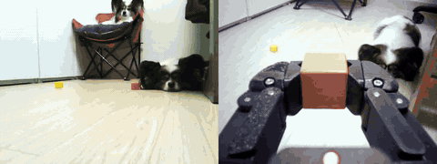
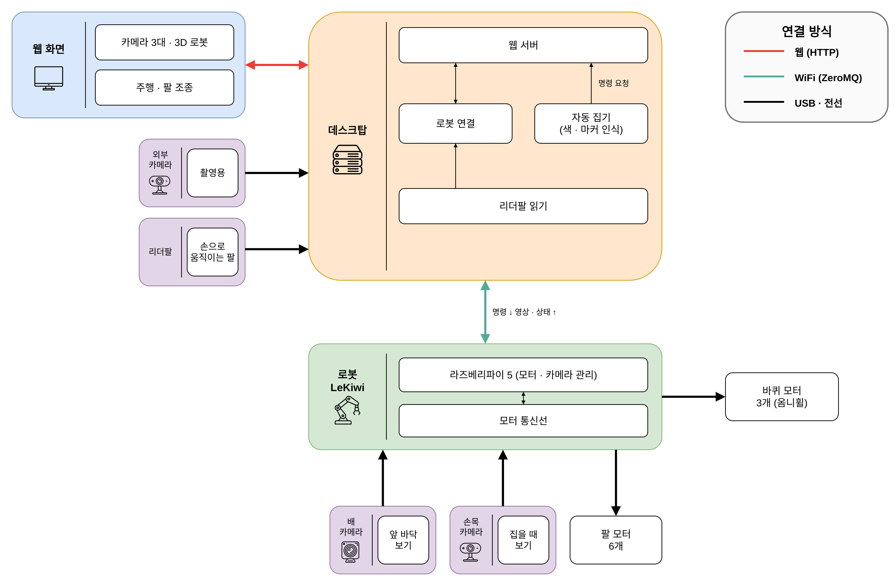

# LeKiwi Mobile Manipulator

오픈소스 LeRobot의 LeKiwi(옴니휠 베이스 + SO-101 팔) 설계를 직접 조립하고, 리더팔 원격 조종을 거쳐 색깔 블록을 스스로 찾아 보관함에 넣는 자율 집기까지 구현한 기록입니다.

완성된 로봇을 받아서 쓰는 것이 아니라, 모터 하나하나의 ID를 굽고, 관절 가동범위를 캘리브레이션하고, 리더팔–팔로워 통신을 맞추는 구동 과정 자체를 직접 구축했습니다. lerobot 0.6.2 기준.


| 항목  | 사양  |
| --- | --- |
| 로봇팔 | SO-101 팔로워, Feetech STS3215 × 6 |
| 그리퍼 | Pin Gripper |
| 베이스 | 3륜 옴니휠, STS3215 × 3 |
| 메인 컴퓨터 | Raspberry Pi 5 / Ubuntu 24.04 |
| 조종 | SO-101 리더팔(데스크탑 USB) + 키보드 |
| 카메라 | 손목캠 Pecxin-1M-2012V1 / 베이스캠 Arducam / 외부 Logitech C270(촬영용) |
| 모터 배터리 | 리튬이온 3S 12.6V (3S2P 21700) |
| 모터 드라이버 | Waveshare Serial Bus Servo Driver (DC 9~12.6V, USB/UART) |
| 관제 화면 | 브라우저 웹 GUI (카메라 3대 + 3D 디지털 트윈 + 바닥 맵 + 조종) |
| 자율 집기 | OpenCV 색 검출 + ArUco 마커 + 카메라 렌즈 보정, 규칙 기반 제어 (학습 모델 없음) |
| 시뮬레이션 | Gazebo (옴니휠+라이다 주행/Nav2 검증용) |
| 개발 기간 | 2026– |

## 현재까지 된 것

모터 세팅
- 팔로워 9축(팔 6 + 옴니휠 3) ID 등록 및 스캔 검증
- 리더팔 6축 ID 등록
- 공장값(전부 ID 1) 충돌을 피해 한 축씩 등록하는 절차 확립

캘리브레이션
- 팔로워/리더 전 관절 호밍 + 가동범위 측정, 정규화값으로 검증
- 손으로 안 움직이는 그리퍼는 모터로 구동해 스톨 지점으로 범위 측정
- 엔코더 경계를 걸치는 관절은 궤적 unwrap 후 중앙 재정렬

조종 (teleop)
- 데스크탑 ↔ Pi ZMQ 연결, 옴니휠 6방향 주행 확인
- 리더팔 → 팔로워 팔 미러링(부드러운 램프 시작)
- 전체 조종(팔 + 주행) 동작 확인

웹 관제 화면
- 카메라 3대(베이스 · 손목 · 외부) 동시 스트리밍
- 실제 STL 로 만든 3D 디지털 트윈 - 로봇 자세를 20Hz 로 따라감
- 바닥 맵 - 바퀴가 실제로 돈 만큼 위치를 쌓아 3D 로봇이 격자 위를 돌아다니고 지나온 길을 그림
- 브라우저에서 주행 · 팔 조종, 관절 각도 직접 입력, 자율 집기 시작 · 멈춤
- Pi · 모터 배터리 잔량과 충전 여부 표시
- 연결이 끊기면 화면에 표시하고 자동 재연결

자율 집기
- 빨강 · 노랑 블록을 베이스캠으로 찾아(좌우 훑기 → 한 바퀴) 다가감
- 손목캠으로 넘겨받아 옴니휠로 기준점 정렬 → 리더팔로 가르친 자세로 집기
- 그리퍼가 멈춘 값으로 집기 성공 판정, 실패 시 재정렬
- ArUco 마커 각도로 보관함 정면 지점을 계산해 비스듬히 있어도 정면으로 가서 넣기
- 빨강 · 노랑 블록 4개 연속으로 보관함에 넣기 (렌즈 보정 후 다시 확인)
- 색깔별 분류(빨강은 보관함 A, 노랑은 보관함 B) - 코드는 완성, 실제 주행 시험 전

카메라 렌즈 보정
- 체커판 사진으로 베이스캠 · 손목캠의 초점거리와 렌즈 휨을 계산
- 베이스캠 초점거리가 그동안 24% 크게 잡혀 있던 것을 찾아 고침 (줄자 56cm ↔ 계산 57cm)
- 바닥까지 거리를 화면 위치로 계산 (가까운 쪽이 음수로 나오던 문제 해결)

전원 관리
- Pi 배터리가 바닥나면 로봇을 멈추고 Pi 를 안전하게 끔 (실제 방전에서 동작 확인)
- 부팅하면 저전압 감시와 로봇 호스트가 자동으로 켜짐

## 자율 집기

<a href="docs/media/autopick-4blocks.mp4"></a>

빨강 2개 · 노랑 2개를 연속으로 찾아 집고 보관함에 넣는 모습(왼쪽 베이스캠, 오른쪽 손목캠, 9배속 미리보기). 이미지를 누르면 3배속 영상으로 이동한다. 같은 시간의 관제 화면은 [`web-autopick-4blocks.mp4`](docs/media/web-autopick-4blocks.mp4), 처음 성공한 빨강 1개 영상은 [YouTube](https://youtu.be/ivkX3ZNEQ3s).

팔 각도를 매번 역기구학으로 푸는 대신, **옴니휠로 몸 전체를 움직여 블록이 손목캠의 같은 자리에 오게** 만들고, 팔은 리더팔로 가르친 자세(보기 · 집기 · 넣기)만 반복한다. 옴니휠은 앞뒤 · 좌우 · 회전이 독립이라 화면 오차를 그대로 바퀴 명령으로 바꿀 수 있다.

| 단계  | 카메라  | 방법  |
| --- | --- | --- |
| 찾기 · 다가가기 | 베이스캠 | HSV 색 검출, 화면 중심 오차로 회전하며 전진 |
| 정렬 | 손목캠 | 3cm 이동 시 화면 이동량을 스스로 측정 → 오차를 바퀴 이동으로 환산 |
| 집기 확인 | 손목캠 + 그리퍼 | 블록을 물면 46에서 멈춤, 빈손이면 94.5까지 닫힘 |
| 보관함 | 베이스캠 | ArUco 마커 크기 · 각도와 렌즈 보정값으로 거리와 정면 지점 계산 |

```bash
cd desktop/web && ./start_lekiwi.sh       # 웹 서버 (로봇 연결을 쥠)
cd desktop/pick && python auto_pick.py red yellow          # 보이는 블록을 전부 보관함 A 로
cd desktop/pick && python auto_pick.py red yellow --sort   # 빨강은 A, 노랑은 B 로 나눠 넣기 (시험 전)
```

설계 · 색 기준값 · 실측 데이터는 [`docs/자율집기.md`](docs/자율집기.md).

### 카메라 렌즈 보정

마커 거리는 `초점거리 × 마커 크기 ÷ 화면 속 마커 크기` 로 계산하므로 초점거리가 틀리면 거리 숫자도 그만큼 틀린다. 체커판을 여러 각도로 찍어 두 카메라의 초점거리와 렌즈 휨을 구했다.

| 카메라  | 결과  | 확인 방법  |
| --- | --- | --- |
| 베이스캠 | 초점거리 524px, 오차 0.32px | 범퍼에서 판까지 줄자 56cm ↔ 계산 57cm |
| 손목캠 | 초점거리 600px, 오차 0.42px | 바닥 판까지 실측 약 28cm ↔ 계산 29.1cm |

- 그전까지 쓰던 650px 은 24% 큰 값이었다. 보관함 앞에 서는 거리 숫자들은 사실 실제보다 1.24배로 나오고 있었다. 숫자만 실제 미터로 바꾸고 로봇이 서는 자리는 그대로 두어, 바꾼 뒤에도 같은 동작으로 4개 연속 성공했다.
- 손에 든 종이는 휘어서 판 하나에 2~6px 오차가 생겼다. 종이를 판지에 붙여 바닥에 두고 팔을 움직여 찍었다.
- 손목캠은 그리퍼 손가락이 화면 양쪽 아래를 가려 판이 가운데에만 들어간다. 그래서 렌즈 중심은 화면 정중앙으로 고정하고 초점거리와 휨만 구했다.

보정 사진은 `calib_ui.py` 화면(다음에 판을 둘 자리를 파란 네모로 알려 줌)에서 찍고 `calib_solve.py` 로 계산한다.

## 하드웨어

옴니휠 3륜 베이스 위에 SO-101 팔로워 팔을 올린 구성. 베이스에 라즈베리파이 5와 모터 드라이버, 3S 리튬이온 배터리를 실었고, 손목과 베이스에 카메라를 두었다. 조종은 같은 STS3215로 만든 SO-101 리더팔을 데스크탑에 USB로 연결해서 한다.

|  |  |
| --- | --- |
|  |  |
|  |  |

## 구조



작업에서 지킨 것:

1. 한 번에 한 축씩 검증 - 모터 ID를 하나 새길 때마다 스캔으로 확인하고, 캘리 저장 후엔 정규화 위치값이 범위 안에 드는지로 검증. 눈에 보이는 근거를 확보한 뒤 다음 단계로.
2. 팔로워는 Pi, 조종 로직은 데스크탑 - Pi는 모터 · 카메라를 다루는 호스트 데몬만, 리더팔 · 키보드 입력과 매핑은 데스크탑 클라이언트가 담당. 역할을 나눠 디버깅을 단순하게.
3. 증거 기반 디버깅 - "안 된다" 대신 통신 응답코드(무응답 -6 / 충돌 -7), 실측 전압, 발견된 모터 목록 같은 관측값으로 원인을 좁혔다.

## 파일 구성

```
lerobot-lekiwi-mobile-manipulator/
├── pi_tools/                 # 라즈베리파이(팔로워)에서 실행
│   ├── scan_motors.py        # 모터 ID 스캔
│   ├── setup_one.py          # 모터 ID 한 축씩 등록
│   ├── calib_step1.py        # 캘리 1단계 - 가운데자세 호밍
│   ├── record_arm.py         # 캘리 2단계 - 팔 관절 범위 기록(이상값 필터)
│   ├── gripper_range.py      # 그리퍼 범위 - 모터로 구동해 측정
│   ├── wrist_sweep.py        # 손목굽힘 궤적 기록
│   ├── wrist_fix.py          # 손목굽힘 unwrap 재중심
│   ├── calib_finalize.py     # 캘리 병합/저장/검증
│   ├── read_batt.py          # 모터 배터리 전압 읽기
│   ├── read_ups.py           # 라즈베리파이 UPS 배터리 읽기 (I2C)
│   ├── run_host.sh           # 호스트 데몬 실행 (-b 백그라운드+자동 재시작 / -s 상태 / -k 중지)
│   ├── host_watchdog.sh      # 호스트가 죽으면 다시 켜는 감시 루프
│   ├── lekiwi_host_plus.py   # 호스트 + 모터 배터리 전압 기록 (포트를 두 번 열지 않게)
│   └── battery_guard.py      # Pi 배터리 저전압 자동 종료 (부팅 시 자동 실행)
├── desktop/                  # 데스크탑에서 실행 (리더팔 연결)
│   ├── my_lekiwi_teleop.py   # 전체 조종 (리더팔 + 키보드)
│   ├── leader_setup_one.py   # 리더팔 모터 ID 등록
│   ├── leader_sweep_all.py   # 리더팔 전관절 스윕
│   ├── leader_finalize.py    # 리더팔 캘리
│   ├── wheel_test.py         # 바퀴 6방향 테스트
│   ├── wheel_test_slow.py    # 바퀴 천천히(관찰용)
│   ├── arm_teleop_test.py    # 팔 미러링만 (헤드리스)
│   ├── pick/                 # 자율 집기
│   │   ├── auto_pick.py      # 전체 흐름 (찾기→다가가기→정렬→집기→보관함→넣기)
│   │   ├── color_detect.py   # HSV 색 블록 검출 (색 · 카메라별 기준)
│   │   ├── approach_marker.py# ArUco 마커 거리 · 각도, 보관함 접근
│   │   ├── calib_cam.py      # 렌즈 보정값 읽기, 화면 위치 → 바닥 거리
│   │   ├── calib_ui.py       # 렌즈 보정 사진 찍는 화면 (다음 자리 안내)
│   │   ├── calib_solve.py    # 렌즈 보정 계산 (휜 사진 자동 제외)
│   │   ├── calib_capture.py, calib_drive.py, calib_boards.py  # 보정 사진 찍기 도구
│   │   ├── front_calib.json, wrist_calib.json                 # 보정 결과
│   │   ├── depth_test.py     # 깊이 추정으로 앞 장애물까지 거리 재기 (시험 중)
│   │   ├── robot_api.py      # 웹 서버 API 래퍼 (최신 프레임만 유지)
│   │   ├── poses.json        # 가르친 자세 · 기준점 · 그리퍼 기준값
│   │   ├── record.py         # 시연 녹화 (외부+베이스+손목 합본)
│   │   ├── make_aruco.py     # 마커 인쇄 PDF 생성
│   │   ├── aruco_box_3.5cm.pdf, aruco_boxB_3.5cm.pdf   # 보관함 A · B 마커
│   │   ├── checker_9x6_25mm.pdf, checker_9x6_12mm_small.pdf  # 보정용 체커판
│   │   └── test_drive_dir.py # 주행 방향 실측
│   └── web/                  # 웹 관제 화면
│       ├── lekiwi_web.py     # 서버 (카메라 중계 + 조종 API + 워치독 + 위치 계산)
│       ├── lekiwi_web.html   # 화면 (3D 트윈 · 바닥 맵 포함)
│       ├── fetch_meshes.py   # 3D 메시 받아서 브라우저용으로 변환
│       ├── start_lekiwi.sh   # 웹서버 + 브라우저 한 번에
│       └── watch_leader.py   # 리더팔 값 실시간 확인 (진단용)
└── docs/
    ├── images/               # 로봇 사진, 웹 GUI 화면
    ├── demo/, media/         # 데모 GIF · 영상
    ├── 웹GUI.md               # 웹 관제 화면 상세 (좌표계 · 각도 변환 함정 정리)
    ├── 자율집기.md            # 자율 집기 설계 · 실측값 · 결과
    └── 개발노트.md            # 진행 내역 + 전체 디버깅 기록
```

## 실행

### 1. 모터 ID 등록

새 STS3215는 전부 공장값 ID 1이라 버스에 여럿 물리면 충돌한다. 한 번에 하나만 연결해 등록.

```bash
# 팔로워 (Pi)  gripper6 → wrist_roll5 → wrist_flex4 → elbow3 → shoulder_lift2 → shoulder_pan1 → wheels 9,8,7
python pi_tools/setup_one.py arm_gripper
# 리더 (데스크탑)  gripper6 → 5 → 4 → 3 → 2 → 1
python desktop/leader_setup_one.py gripper
# 확인
python pi_tools/scan_motors.py
```

등록 전에 항상 스캔해 버스에 ID 1이 하나만 있는지 확인할 것. 아니면 이미 등록된 모터를 덮어쓴다.

### 2. 캘리브레이션

```bash
# 팔로워 (Pi)
python pi_tools/calib_step1.py       # 팔을 각 관절 가운데로 두고 실행
python pi_tools/record_arm.py        # 팔 4관절 끝~끝 왕복, 끝나면 touch /tmp/record_arm_stop
python pi_tools/gripper_range.py     # 그리퍼는 기어라 모터로 구동해 측정
python pi_tools/calib_finalize.py    # 병합/저장/검증

# 리더 (데스크탑)
python desktop/leader_sweep_all.py   # 6관절 끝~끝 스윕, 끝나면 touch /tmp/leader_stop
python desktop/leader_finalize.py    # unwrap 자동중심 + 마진으로 저장
```

### 3. 조종

```bash
# Pi에서 호스트 데몬 (SSH 끊겨도 유지: setsid nohup)
ssh <pi> 'cd ~/lerobot && source .venv/bin/activate && \
  setsid nohup python -m lerobot.robots.lekiwi.lekiwi_host --robot.id=my_lekiwi --host.connection_time_s=3600 >/tmp/host.log 2>&1 </dev/null &'

# 데스크탑에서 조종 (리더팔로 팔, W/S/A/D/Z/X로 주행)
cd ~/lerobot && source .venv/bin/activate
LEKIWI_IP=<pi-ip> python my_lekiwi_teleop.py
```

부분 확인: 팔만 `arm_teleop_test.py`, 바퀴만(공중에 띄우고) `wheel_test_slow.py`.

## 웹 관제 화면

브라우저 하나에서 카메라 3대를 보면서 로봇을 조종한다. 팔 자세는 실제 STL 로 만든
3D 모델이 실시간으로 따라간다.

<a href="https://youtu.be/RbKLVp3t7v8"></a>

리더팔로 조종하는 모습. 카메라 3대와 3D 트윈이 함께 따라간다.

```bash
# 준비 (처음 한 번만) - 3D 메시를 공개 저장소에서 받아 브라우저용으로 변환
cd desktop/web && python3 fetch_meshes.py

# 실행
./start_lekiwi.sh          # 웹서버 + 브라우저
# 화면의 「전체 시작」 버튼 → Pi 데몬 확인 → 로봇 연결 → 리더팔 연결까지 자동
```

| 구역  | 내용  |
| --- | --- |
| 카메라 | 베이스(Arducam, 180° 보정) / 손목(90° 보정) / 외부 웹캠 |
| 3D 트윈 | 관절 6축 + 옴니휠 3개가 실제 값을 따라 움직임 |
| 바닥 맵 | 8m 격자 위로 로봇이 이동, 노란 점선 = 지나온 길, 「원점」 「따라가기」 버튼 |
| 자율 집기 | 시작 · 멈춤, 진행 단계와 로그 |
| 전원 | Pi 배터리 % · 충전 중 표시, 모터 배터리 전압 |
| 주행 | 버튼 또는 W/S · A/D · Z/X, 속도 조절 |
| 팔 | 잠금 / 슬라이더(각도 직접 입력) / 리더팔 미러링 |

### 바닥 맵은 바퀴가 돈 만큼 쌓아서 그린다

로봇은 바퀴 세 개의 실제 회전 속도를 몸체 속도(앞뒤 · 좌우 m/s, 회전 도/초)로 바꿔 보내 준다. 웹 서버가 이 값에 시간을 곱해 계속 더해서 "출발점에서 몇 m 갔고 몇 도 돌았는지"를 구하고, 3D 로봇을 그 자리로 옮긴다.

| 명령  | 계산된 값  |
| --- | --- |
| 왼쪽 45° 회전 | 46° |
| 앞으로 10cm | 10.0cm |
| 앞 20cm → 왼쪽 90° → 앞 16cm 후 같은 길로 되돌아오기 | 원점에서 0.5cm · 0.5° |

바퀴가 미끄러지거나 무언가에 걸리면 실제 위치와 어긋난다. 그럴 땐 「원점」으로 다시 맞춘다. 벽 · 가구 같은 방 구조는 아직 그리지 않는다.

### 3D 모델은 URDF 세 개를 합쳐서 만든다

| 부분  | 출처  | 이유  |
| --- | --- | --- |
| 베이스 · 옴니휠 | [SIGRobotics-UIUC/LeKiwi](https://github.com/SIGRobotics-UIUC/LeKiwi) | 베이스 형상 |
| 팔 6축 | [TheRobotStudio/SO-ARM100](https://github.com/TheRobotStudio/SO-ARM100) | **각도 정의가 lerobot 과 일치** |
| Pin 그리퍼 | [smart-factory-soarm101](https://github.com/kimar1022-code/smart-factory-soarm101) | 실제 장착한 그리퍼 |

팔을 LeKiwi URDF 로 그리면 관절이 실물과 반대로 돈다. 두 URDF 가 다른 도구로
만들어져 축 규약이 다르기 때문. SO-101 URDF 는 가동범위가 lerobot 캘리브레이션
값과 거의 일치해(어깨들기 ±97.9° vs ±100°) 부호 보정 없이 그대로 쓸 수 있다.

베이스와 팔을 잇는 변환은 **같은 부품(팔 베이스)을 두 URDF 가 각각 어떻게 놓았는지**
비교해서 계산한다. `so_base_link = LeKiwi_link · lk_visual · so_visual⁻¹` 로 풀면
`xyz=[0, 0.0283, 0.007], rpy=[0,0,90°]` 가 나온다. 딱 떨어지는 값이라 시행착오가
아님을 알 수 있다.


## 트러블슈팅

굵직한 것만. 전체 기록은 [`docs/개발노트.md`](docs/개발노트.md#트러블슈팅-전체-기록).

- **캘리 범위가 엔코더 경계(0/4095)를 걸침** - 호밍 기준이 실제 중앙과 어긋나 관절 범위가 0↔4095 이음매를 넘어가고 정규화값이 100%를 넘었다. 궤적을 raw 로 기록해 unwrap 한 뒤 범위 중앙이 2047 이 되도록 호밍을 다시 계산.
- **통신은 되는데 모터가 안 움직임** - `write_calibration` 이 캘리 범위를 모터의 위치 제한(Min/Max_Position_Limit)에도 굽는다. 잘못 측정된 폭 1짜리 범위가 새겨져 그리퍼가 1스텝 안에 갇혀 있었다. 제한을 풀고 재측정.
- **조종 중 모터가 랜덤하게 버스에서 빠짐** - 매번 다른 축이 빠져 배선을 의심했지만, 버스 전압이 10.5V(3S 방전 근처)였다. 부하 때 전압이 꺼지는 브라운아웃. 통신 무응답(-6) · 충돌(-7) 응답코드로 원인을 좁히는 방식으로 리더팔 보드 불량도 찾았다.
- **바퀴만 보내도, 팔만 빼도 호스트가 터짐** - lerobot 의 `send_action` 은 팔(.pos) · 바퀴(.vel) 키를 항상 함께 요구한다. 팔을 안 움직일 때도 현재 자세를 같이 보낸다.
- **3D 트윈의 관절 각도가 80° 넘게 어긋남** - 정규화값의 0° 를 엔코더 중앙(2048)으로 잡았는데, lerobot 은 **캘리 범위의 중앙**이 0° 다. 그리퍼만 0~100 정규화라 식이 따로다.
- **로봇이 죽었는데 화면은 「연결됨」** - 클라이언트가 새 데이터가 없어도 마지막 관측을 계속 돌려준다. 카메라 프레임이 실제로 바뀌는지로 생존을 판단하는 워치독 + 호스트 자동 재시작으로 해결. 이 화면으로 마커 위치를 잘못 판단한 적이 있어, 판단 전 프레임 갱신 확인을 규칙으로 삼았다.
- **같은 시리얼 포트를 두 프로세스가 열어 호스트가 죽음** - 배터리 표시용으로 모터 포트를 따로 열자 패킷이 섞였다(리눅스는 동시 열기를 막지 않는다). 호스트 프로세스 안에서 읽어 파일로 넘기게 바꿈(lerobot 코드는 감싸서 사용).
- **마커 거리가 24% 크게 나옴** - 이동량 · 마커 크기로 어림한 초점거리 650px 이 체커판 보정으로는 524px. 줄자로 어느 쪽이 맞는지 확정했다(56cm ↔ 57cm / 70cm). 멈춤 거리 상수를 같은 비율로 환산해 **동작은 그대로 두고 단위만 실제 m 로** 바꾸고, 4개 연속 성공으로 회귀가 없음을 확인.
- **브라우저에서 3D 모델 · 상태 API 가 멈춤** - 브라우저는 호스트당 HTTP/1.1 연결을 6개까지만 연다. MJPEG 스트림 3개가 연결을 붙잡고 새로고침 때도 안 끊겨 고갈됐다. 스트림을 다른 호스트 이름(`127.0.0.1`)으로 분리하고 `pagehide` 에서 끊어 해결.

## 오늘 한 것 (2026-10-07)

- **카메라 렌즈 보정** - 베이스캠 · 손목캠 내부 파라미터를 구하고, 거리 계산의 24% 오차를 줄자로 검증해 바로잡음. 기존 동작은 유지한 채 단위만 실제 m 로 바꾸고 블록 4개 연속 성공으로 회귀 확인.
- **오도메트리 + 웹 디지털 트윈 맵** - 바퀴 엔코더 속도를 적분해 위치를 구하고 3D 화면에 궤적과 함께 표시. 명령 대비 회전 46° / 45°, 직진 10.0cm / 10cm, 왕복 후 원점 오차 0.5cm.
- **저전압 안전 종료 실전 검증** - 실제 방전에서 3.39V 에 로봇 정지 → 파일 동기화 → Pi 종료까지 동작.
- **단안 깊이 추정으로 장애물 거리 PoC** - Depth Anything V2 Small(GPU 0.1초/장)로 30 · 50cm 물체를 오차 2cm 안으로 측정. 주행 연동은 다음 단계.

## 앞으로 할 것

- [x] 팔로워/리더 모터 ID 등록
- [x] 팔로워/리더 캘리브레이션
- [x] 데스크탑↔Pi 연결, 옴니휠 주행 확인
- [x] 리더팔 → 팔로워 팔 미러링 확인
- [x] 전체 조종(팔 + 주행) 확인
- [x] 손목/베이스 카메라 스트리밍 확인
- [x] 웹 관제 화면 + 3D 디지털 트윈
- [ ] Gazebo에 옴니휠+라이다 URDF 올려 SLAM/Nav2 주행 시뮬 검증 (실물 이관 전)
- [x] 규칙 기반 자율 집기 - 색 블록 찾기 · 집기 · 보관함 넣기 (OpenCV + ArUco)
- [x] 노랑 블록 손목캠 기준 측정, 여러 개 연속 집기 (4개 연속)
- [x] 보관함이 비스듬해도 정면으로 가서 넣기
- [x] 보관함 네 면에 마커, 멀리서 작게(10px) 보이는 마커도 찾기
- [x] 웹 화면에서 자율 집기 시작 · 멈춤, 진행 단계 표시
- [ ] 색깔별 분류 실제 주행 시험 (보관함 B 마커 PDF 와 코드는 준비됨)
- [x] 베이스캠 · 손목캠 렌즈 보정, 거리 계산에 적용
- [x] 렌즈 보정 사진 찍는 화면 (다음 자리 안내, 흔들린 사진 거르기)
- [x] 렌즈 보정 후 블록 4개 연속 성공, 데모 영상 정리
- [x] 웹 화면 바닥 맵 (바퀴로 잰 위치 · 지나온 길), 바퀴가 실제 속도로 회전
- [x] 웹 화면 3D 모델이 안 뜨던 문제 해결 (브라우저 연결 6개 제한)
- [x] Pi 저전압 자동 종료, 부팅 시 자동 시작 (실제 방전에서 확인)
- [x] Pi · 모터 배터리 실시간 표시 (호스트가 모터 전압을 직접 기록)
- [x] 앞 장애물 거리 재기 시험 (깊이 추정, 블록 30 · 50cm 를 28~30 · 48cm 로 잼)
- [ ] 충전기 선이 꽂혀 있으면 출발하지 않기 (충전 여부는 이미 읽고 있음)
- [ ] 부딪힘 감지 - 바퀴 부하가 갑자기 커지면 멈추고 물러나기
- [ ] 색만 보지 않고 모양 · 크기로 한 번 더 거르기 (노랑 무늬 강아지 공을 블록으로 착각함)
- [ ] 앞 장애물 거리 재기를 주행에 연결 (`depth_test.py`)
- [ ] 비스듬히 놓인 블록은 손목을 돌려서 집기
- [ ] 보관함 마커 위치를 맵에 찍고 그걸로 위치 바로잡기
- [ ] RealSense D435i 로 방 지도 만들기 (SLAM)
- [ ] 높이가 다른 물체 - 집기 단계를 역기구학으로 교체
- [ ] 조종 시연 데이터 수집 (`lerobot record`)
- [ ] 수집 데이터로 정책 학습(ACT) 후 규칙 기반과 비교
