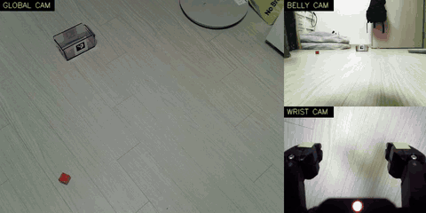
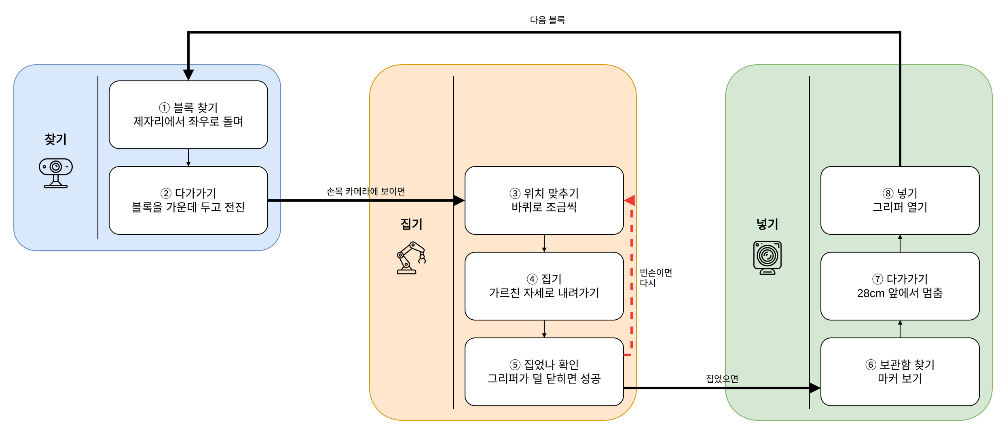

# 자율 집기 - 색깔 블록을 찾아 보관함에 넣기

LeKiwi 가 바닥의 빨간 · 노란 블록을 스스로 찾아가 집고, ArUco 마커를 붙인 투명 보관함에
넣는다. 학습 모델 없이 OpenCV 와 규칙 기반 제어만 쓴다. 코드는 `desktop/pick/`.

전체 영상(58초, 외부 + 베이스 · 손목 카메라): [YouTube](https://youtu.be/ivkX3ZNEQ3s) · 원본 [`media/autopick-red.mp4`](media/autopick-red.mp4)

## 카메라 역할

| 카메라 | 역할 | 이유 |
| --- | --- | --- |
| 베이스캠 (Arducam) | 찾기 · 다가가기 · 보관함 접근 | 바닥 앞쪽을 넓게 본다. 몸에 고정이라 마커 크기로 거리 계산이 된다 |
| 손목캠 | 최종 정렬 · 집기 확인 | 그리퍼 바로 위에서 가까이 본다 |
| 외부 웹캠 (C270) | 촬영 전용 | 시야가 좁아 제어에는 안 쓴다 |

## 설계: 팔은 가르친 자세만, 맞추는 건 바퀴로

매번 역기구학으로 팔 각도를 푸는 대신, **옴니휠로 몸 전체를 움직여 블록이 늘 같은
자리에 오게** 만든다. 그러면 팔은 리더팔로 한 번 가르친 자세 세 개만 반복하면 된다.

| 자세 | 내용 |
| --- | --- |
| `look` | 손목캠이 바로 앞 바닥을 내려다봄. 블록이 화면 (290, 178) 에 오면 집을 위치 |
| `pick` | 벌린 그리퍼가 블록을 감싸는 높이 |
| `drop` | 보관함 입구 위. 보관함 마커가 0.28m 일 때 기준 |

옴니휠은 앞뒤 · 좌우 · 회전이 독립이라 화면 오차를 그대로 바퀴 명령으로 바꿀 수 있다.
바닥 높이의 블록에는 이 방식이 가장 단순하고 오차가 작다. 높이가 다른 물체는 이후
`pick` 단계만 역기구학으로 바꿀 계획이다(흐름은 그대로 재사용).

## 동작 순서

1. **찾기** - 오른쪽 45° → 왼쪽 45° 까지 훑고, 없으면 왼쪽으로 한 바퀴. 돌면서 매 프레임 검사하고, 보이면 멈춰서 다시 보고 확정한다.
2. **다가가기** - 블록이 화면 가운데 오도록 회전하며 전진. 직전 위치에서 가장 가까운 검출만 따라가 다른 블록으로 갈아타지 않는다.
3. **넘겨받기** - 손목캠에 블록이 보이는 순간 정지. 베이스캠 정지선을 따로 측정할 필요가 없다. 블록이 베이스캠 아래로 사라지면 손목캠에 잡힐 때까지 천천히 전진.
4. **정렬** - 손목캠 화면 오차 → 바퀴 이동량. 처음 한 번 앞 · 옆으로 3cm 씩 움직여 화면 이동량(자코비안)을 스스로 잰다(앞 3cm → 화면 아래 72px, 왼쪽 3cm → 화면 오른쪽 79px). 0.7배씩만 움직여 넘치지 않게 하고, 오차 10px 이내면 완료. 보통 2~3번.
5. **집기** - `pick` 자세로 내려가 그리퍼를 3씩 닫다가, 목표와 실제 차이가 6 이상 벌어지면(막힘 = 블록에 닿음) 멈춘다. 블록을 물면 약 46, 빈손이면 94.5 까지 닫힌다. 이 차이와 손목캠의 블록 면적으로 성공을 판정하고, 실패하면 다시 정렬부터.
6. **보관함** - 마커를 찾아 회전 · 전진, 거리 0.28m · 좌우 오차 12px 이내에서 정지 → `drop` 자세 → 그리퍼 열기.

## 색 검출

HSV 로 바꿔 색상 범위 + **색마다 다른 채도 · 밝기 최소값**으로 거른 뒤, 연결 성분 중
네모나고(가로세로비 2.5 이하) 꽉 찬(채움률 55% 이상) 덩어리만 블록으로 인정한다.

| | 색상 H | 채도 S | 밝기 V |
| --- | --- | --- | --- |
| 노랑 블록 (베이스캠) | 25 | 247 | 253 |
| 갈색 가구 다리 | 23 | 127 | 95 |
| 빨강 블록 (베이스캠) | 0 | 206 | 164 |
| 빨강 블록 (손목캠) | 3 | 120~165 | 202 |
| 그리퍼 끝 연두 스티커 | 32~34 | 87~116 | 160~179 |

- **갈색은 어둡고 흐린 노랑이다.** 색상만 보면 구분이 안 돼 가구 다리가 노랑으로 잡혔다. 노랑은 S≥180, V≥150 을 요구해 해결.
- **카메라마다 색감이 다르다.** 같은 빨강이 손목캠에서는 S 120~165 로 연하다. 카메라별 기준(`CAM_SV`)을 따로 둔다.
- 보라(H 119)와 파랑(H 112)은 경계가 좁아 데모에서는 빨강 · 노랑만 쓴다.
- 베이스캠은 수평선 아래(바닥)만, 손목캠은 아래쪽 LED · 로봇 몸체를 뺀 영역만 본다.
- 투명 보관함 안의 블록은 마커 주변 영역을 빼서 다시 집으러 가지 않게 한다.

## 보관함과 거리

ArUco `DICT_4X4_50` ID 0, 검은 사각형 3.5cm 를 보관함 정면에 붙였다(`make_aruco.py`,
인쇄는 100% 크기). 거리 = 초점거리 × 마커 크기 / 화면 속 마커 한 변.

베이스캠 초점거리 650px 은 두 방법으로 따로 구해 일치를 확인했다.
- 옆으로 5cm 이동 시 마커가 33px 이동 → 거리 1.0m 일 때 f ≈ 650
- 같은 위치에서 3.5cm 마커가 24.5px → 거리 0.94m

## 주행 방향 실측

자동으로 맡기기 전에 초속 5cm · 1초씩 움직여 마커 변화로 방향을 확인했다(`test_drive_dir.py`).

| 명령 | 결과 |
| --- | --- |
| `x=+0.05` | 마커 24.5 → 26.3px (전진) |
| `theta=+15` | 마커가 화면 오른쪽으로 172px (반시계 회전, 약 15°) |
| `y=+0.05` | 마커가 화면 오른쪽으로 33px (왼쪽 이동) |

왕복 오차가 1~2px 이라 바퀴 미끄러짐도 거의 없다.

## 구조

자동 동작은 웹 관제 서버(`desktop/web/lekiwi_web.py`)의 HTTP API 로 명령한다.
로봇 연결은 서버 하나만 쥐고 있으므로, 자동 동작 중에도 브라우저로 카메라를 볼 수 있다.

| 파일 | 역할 |
| --- | --- |
| `auto_pick.py` | 전체 흐름 (`python auto_pick.py red yellow`, `--once`) |
| `color_detect.py` | 색 블록 검출 |
| `approach_marker.py` | 마커 검출 · 거리, 보관함 접근 |
| `robot_api.py` | 서버 API 래퍼. 카메라는 최신 프레임만 유지 |
| `poses.json` | 가르친 자세, 기준점, 그리퍼 기준값, 손목캠 자코비안 |
| `record.py` | 시연 녹화 (외부 + 베이스 · 손목 합본) |
| `make_aruco.py` | 마커 인쇄용 PDF |
| `test_drive_dir.py` | 주행 방향 확인 |

## 결과

| 회차 | 걸린 시간 | 비고 |
| --- | --- | --- |
| 1 | 85초 | 찾기에 300° 회전 (한쪽으로만 돌던 방식) |
| 2 | 82초 | 정렬 3번, 오차 3px |
| 3 | 53초 | 블록이 처음부터 시야 안. 좌우 훑기로 바꾼 뒤 보관함을 -36° 지점에서 찾음 |

세 번 모두 성공. 매 회 손목캠의 집은 직후 · 놓는 순간 사진을 `logs/` 에 남겨 판정 근거로 썼다.

## 부딪힌 문제

- **멈춘 화면으로 판단** - 라즈베리파이 호스트가 모터 통신 오류(`Incorrect status packet`) 한 번에 종료됐는데, 화면은 마지막 프레임을 계속 보여줘 멀쩡해 보였다. 그 화면으로 마커 위치를 잘못 판단했다. 이후 판단 전에 **연속 프레임이 실제로 바뀌는지**부터 확인하고, 호스트는 감시 루프(`host_watchdog.sh`)로 죽으면 2초 뒤 재시작한다.
- **웹캠 번호가 바뀜** - USB 가 한 번 빠졌다 잡히면 `/dev/video0` 이 `video1` 로 바뀌어 서버가 옛 번호를 붙잡고 멈췄다. `/dev/v4l/by-id/` 이름으로 찾고, 2초 연속 실패하면 다시 여는 방식으로 바꿨다.
- **리더팔 보드 고장** - 컨베이어용 24V 어댑터를 잘못 꽂아 보드(최대 12.6V)의 전원 입구가 죽었다. USB 로는 불이 켜지지만 DC 로는 안 켜지는 것으로 확인. 모터 6개는 보드 교체 후 에러 레지스터 · 전 범위 스윕 · 토크 구동 시험까지 정상이었다.
- **배터리가 충전되지 않음** - 충전기를 배터리가 아닌 모터 드라이버에 꽂아 6시간 동안 전압이 계속 떨어졌다(충전기는 초록불). 출력을 끊고 20분 충전해도 그대로인 것으로 "출력 중 충전 불가" 가설을 배제한 뒤 원인을 찾았다.
